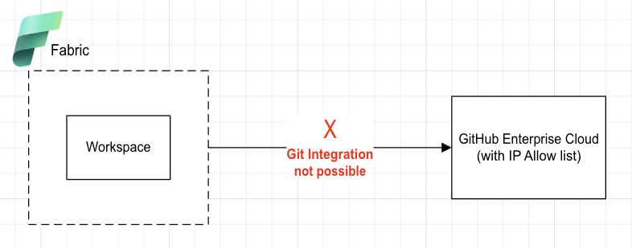
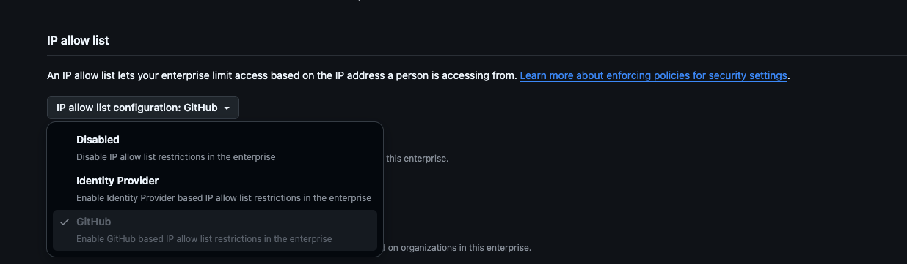

# Fabric Outbound IPs sync with GitHub Enterprise Cloud - IpAllowList

## About
This sample program aim to sync on predefined interval the GitHub Enterprise Cloud - IP Allow list configuration with the current Fabric outbound IPs based on your Fabric home tenant region to enable Fabric Git Integration to work with this enterpeise instance.

## Diagram


## GitHub side - IP Allow List configuration
The solution describe in this repo, supported when your GitHub Enterprise Cloud - IP allow list is configured on the GitHub side, as illustrated here:


## How the solution works
Based on scheduled interval the docker container will perform:
1. Get the updated list of Fabric outbound IP for the request region (tag name: PowerBI.X) 
1. Connect to GitHub Enterprise Cloud instance and find which IPs need to be added / deleted / unchanged using GraphQL Github API
1. Call GraphQL GitHub API to Add / Delete the IP allow list

### Prerequisites

- Azure subscription with Microsoft.Network register
```
az provider register --namespace Microsoft.Network
```
- Create service principal in same Azure subscription (grab the tenant id, client id, client secret) and assign 'reader' permission to Azure subscription
- GitHub PAT which has the following scope for your GitHub Enterprise Cloud: ```admin:enterprise, read:org```
- IMPROTANT: The outbound IP where you run the solution need to be added to IP allow list of your GitHub Enterprise Cloud instance

## How to leverage this solution
### Option 1 - use ready-for-use docker image
- Downdload the docker image
```
docker pull ghcr.io/yaronpri/fabric-ipallowlist-updater:latest
```
- Run the following docker command
```
docker run -d -e AZURE_SUBSCRIPTION_ID=<ID> -e GITHUB_TOKEN=<TOKEN>  -e GITHUB_ENTERPRISE=<NAME> -e FABRIC_REGION=<azure region> -e IP_ALLOW_LIST_MODE=<execution for actual run> -e RUN_INTERVAL_MINUTES=<INTERVAL in MIN> -e AZURE_CLIENT_ID=<SPN client ID}> -e AZURE_TENANT_ID=<TENANT ID> -e AZURE_CLIENT_SECRET=<SPN client secret> ghcr.io/yaronpri/fabric-ipallowlist-updater:latest
```

- You can host this solution on Azure services like: Azure app container , Azure container instance or even Azure VM, make sure you know the outbound ip that the Azure service will use, as its need to be configure as part of the IP allow list

### Option 2 - build your own docker image
- Fork and clone this repo locally
- Build your own docker image, you can change the base image which being used with your equivalent base image
- host it in your environment with outbound ip which configure in the IP allow list

### Option 3 - execute the python program
- Set following environment variable
```
GITHUB_ENTERPRISE = <GITHUB ENTERPRISE NAME>
GITHUB_TOKEN = <PAT TOKEN>
FABRIC_REGION = <YOUR FABRIC HOME TENANT REGION>
AZURE_SUBSCRIPTION_ID=<AZURE SUBSCRIPTION ID>
IP_ALLOW_LIST_MODE = <DEFAULT is to run in dryrun, to actual perform the update operation set this value to execution>
AZURE_TENANT_ID = <AZURE_TENANT_ID>
AZURE_CLIENT_ID = <AZURE_CLIENT_ID>
AZURE_CLIENT_SECRET = <AZURE_CLIENT_SECRET>
```
- execute the python program 
```
python main.py
```